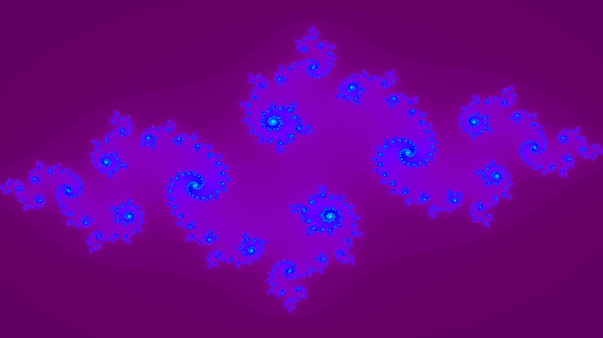

<section id="themes">
	<h2>Themes</h2>
		<p>
			Set your presentation theme: <br>
			<!-- Hacks to swap themes after the page has loaded. Not flexible and only intended for the reveal.js demo deck. -->
			<a href="#" onclick="document.getElementById('theme').setAttribute('href','css/theme/black.css'); return false;">Black (default)</a> -
			<a href="#" onclick="document.getElementById('theme').setAttribute('href','css/theme/white.css'); return false;">White</a> -
			<a href="#" onclick="document.getElementById('theme').setAttribute('href','css/theme/league.css'); return false;">League</a> -
			<a href="#" onclick="document.getElementById('theme').setAttribute('href','css/theme/sky.css'); return false;">Sky</a> -
			<a href="#" onclick="document.getElementById('theme').setAttribute('href','css/theme/beige.css'); return false;">Beige</a> -
			<a href="#" onclick="document.getElementById('theme').setAttribute('href','css/theme/simple.css'); return false;">Simple</a> <br>
			<a href="#" onclick="document.getElementById('theme').setAttribute('href','css/theme/serif.css'); return false;">Serif</a> -
			<a href="#" onclick="document.getElementById('theme').setAttribute('href','css/theme/night.css'); return false;">Night</a> -
			<a href="#" onclick="document.getElementById('theme').setAttribute('href','css/theme/moon.css'); return false;">Moon</a> -
			<a href="#" onclick="document.getElementById('theme').setAttribute('href','css/theme/solarized.css'); return false;">Solarized</a>
		</p>
</section>

H:

# ** Lenguaje Rust ** 

by  [Sebastian Chaves](https://github.com/adamantwharf) - [Laura Santos](https://github.com/lsfinite) - [Jimmy Pulido](https://github.com/jiapulidoar)
I
H:

# Index

<!-- .slide: data-background="#7E2121" --> 
 1. Reseña  <!-- .element: class="fragment" data-fragment-index="1"-->
 1. Recursos Para Rust
 1. Conceptos de Rust <!-- .element: class="fragment" data-fragment-index="2"-->
 1. Ejemplos <!-- .element: class="fragment" data-fragment-index="3"-->
H:

## Acerca de Rust 
  
**Rust** es un lenguaje de programación de sistemas de paradigmas múltiples centrado en la seguridad, especialmente la concurrencia segura.Rust es sintácticamente similar a C ++, pero está diseñado para proporcionar una mejor seguridad de la memoria mientras se mantiene un alto rendimiento.

H: 

## Recursos para aprender Rust:

* [Link Repositorio](https://github.com/FutureUN/RustTutorial/)
* [Link Notebook Tutorial](https://mybinder.org/v2/gh/FutureUN/RustTutorial/master?filepath=tutorial.ipynb)
* [Presentación](https://futureun.github.io/RustTutorial/#/themes)
* [Taller Rust](https://mybinder.org/v2/gh/FutureUN/RustTutorial/master?filepath=Taller.ipynb)
* [Documentación Oficial](https://doc.rust-lang.org/book/)

H:
# Conceptos Básicos de Rust

Recomendamos ver el tutorial desde el  [Notebook](https://mybinder.org/v2/gh/FutureUN/RustTutorial/master?filepath=tutorial.ipynb)

V:
## Variables y mutabilidad

Variables y mutabilidad
Por defecto las variables en Rust son **inmutables.** Este es uno de los muchos codazos que brinda Rust para escribir código en una manera que aproveche la seguridad y facilidad de hacer concurrencia que ofrece Rust.


V:

Cuando una variable es inmutable, una vez que un valor está vinculado a un nombre, no puede cambiar ese valor. Para ilustrar esto, veremos un ejemplo:

```javascript
fn main() {
    let x = 5;
    format!("The value of x is: {}", x);
    x = 6;
    eprintln!("The value of x is: {}", x);
}
main()

```

Error:  cannot assign twice to immutable variable

El mensaje de error indica que la causa del error es que no puede asignar dos veces a la variable inmutable x, porque trató de asignar un segundo valor a la variable inmutable x.

V:
Los enlaces variables son inmutables por defecto, pero esto se puede anular utilizando el modificador mut.
```javascript
fn main() {
    let _immutable_binding = 1;
    let mut mutable_binding = 1;

    println!("Before mutation: {}", mutable_binding);

    // Ok
    mutable_binding += 1;

    println!("After mutation: {}", mutable_binding);

    // Error!
    //_immutable_binding += 1;
    // FIXME ^ Comment out this line
}
main()
```
V: 
## Shadowing 
Es la capacidad de rust para redelarar variables con el mismo nombre, veamoslo con un ejemplo.

```js
println!("Valor de str {}", str);
:vars

// cambiar el valor de una variable inmutable
let str = "Valor de str Rust tutorial";
println!("{}", str);
:vars

// cambiar el valor y el tipo de una variable inmutable

let str = str.len();
println!("Valor de str {}", str);
:vars
```

V: 
## Pertenencia o OwnerShip
El concepto de ownership se refiere a la capacidad de rust para que solo una variable sea la encargada de administrar un espacio de memoria del heap del proceso. 

```js
let mut s = String::from("hello");
//let mut s = "hello";
s.push_str(", world!"); // push_str() concatena el literal al final
// si no se declara de usando String::from no se puede concanenar 
println!("{}", s); 

let str1 = String::from("una cadenita");

let str2 = str1;


// al tratar de imprimir str1 sale un error debido a que la pertenencia fue otorgada a str2
println!("{} ", str2)

// cambiar str1 por str2 ^
```


V:
En el main nos damos cuenta que el valor retornado por gives_ownership se almacena en s1 y pasa a ser parte del alcance del main. Luego, genera una cadena **s2. s3** sera el valor de retorno de la funcion takes_and_gives_back (se ingresa s2 como parametro)
```
    let s1 = gives_ownership();         // gives_ownership moves its return
                                        // value into s1

    let s2 = String::from("hello");     // s2 comes into scope

    let s3 = takes_and_gives_back(s2);  // s2 is moved into
                                        // takes_and_gives_back, which also
                                        // moves its return value into s3
} // Here, s3 goes out of scope and is dropped. s2 goes out of scope but was
  // moved, so nothing happens. s1 goes out of scope and is dropped.

fn gives_ownership() -> String {             // gives_ownership will move its
                                             // return value into the function
                                             // that calls it

    let some_string = String::from("hello"); // some_string comes into scope

    some_string                              // some_string is returned and
                                             // moves out to the calling
                                             // function
}

// takes_and_gives_back will take a String and return one
fn takes_and_gives_back(a_string: String) -> String { // a_string comes into
                                                      // scope

    a_string  // a_string is returned and moves out to the calling function
}
```

V:
# Referencia y Borrowing 

```python
fn main() {
    let s1 = String::from("hello");

    let len = calculate_length(&s1);

    println!("The length of '{}' is {}.", s1, len);
}

fn calculate_length(s: &String) -> usize {
    s.len()
} // Here, s goes out of scope. But because it does not have ownership of what
  // it refers to, nothing happens.

```

Los ampersands son referencias y permiten referirse a algún valor sin tomar ownership de él.

V:
Qué pasa si traramos de modificar algo que pedimos prestado?

```js
fn main() {
    let s = String::from("hello");

    change(&s);
}

fn change(some_string: &String) {
    some_string.push_str(", world");
}

main()
```
V: 

## Referencias Mutables

Podemos corregir el error en el código del anterios con solo un pequeño ajuste:

```
fn main() {
    let mut s = String::from("hello");

    change(&mut s);
}

fn change(some_string: &mut String) {
    some_string.push_str(", world");
}

main()
```
Primero, tuvimos que cambiar s para ser mut. Luego tuvimos que crear una referencia mutable con &mut s y aceptar una referencia mutable con some_string: & mut String.


V: 
## Closure

Una closure es una función anónima que puede ser guardada en una variable y por ende ser enviada como parametro en una función

```
fn test() {
    

    let add_one = |num| {

        // El valor que se quiere retornar se coloca sin punto y coma al final
        num + 1
    };
    
    let mut x = 5;
    println!("llamado de add_one(x)  = {} ", add_one(x));
    
    fn clossure_como_argumento<F>(some_closure: F, x: i32) -> i32
    where F: Fn(i32) -> i32 {

        some_closure(x)
    }
    
    let val = clossure_como_argumento(add_one, 32);
    
    println! ("resultado del closure llamado dentro de una funcion {}", val);
}

test();
```
V: 
## HILOS (THREADS)
Los hilos (Threads) se usan para correr partes de código independientes simultáneamente. Esto puede mejorar el rendimiento del programa al realizar múltiples tareas al mismo tiempo. 

```
use std::time::Duration;

fn main() {
    thread::spawn(|| {
        for i in 1..10 {
            println!("hi number {} from the spawned thread!", i);
            thread::sleep(Duration::from_millis(1));
        }
    });

    for i in 1..5 {
        println!("hi number {} from the main thread!", i);
        thread::sleep(Duration::from_millis(1));
    }
}

main()
```
V:

## CANALES (CHANNELS):
Los canales son un concepto que provee Rust para facilitar la comunicación entre hilos al permitir el intercambio de mensajes. Un canal se compone de **transmitter** (el que transmite) and **receiver** (el que receiver). La idea es enviar datos desde una parte del código y revisar en otra parte la llegada de los mensajes.

```
use std::sync::mpsc;

let (tx, rx) = mpsc::channel();

thread::spawn(move || {
    let val = String::from("hi");
    tx.send(val).unwrap();
    //println!("val is {}", val);
});

let received = rx.recv().unwrap();
println!("Got: {}", received);
```
V: 

## MUTEX (MUTUAL EXCLUSION / EXCLUSION MUTUA)

Este recurso permite que únicamente un recurso tenga acceso a un mismo dato en un momento dado. Para tener acceso al dato, el recurso debe pedir permiso de acceso mediante el mutex’s lock (candado).

```
use std::sync::Mutex;


    let m = Mutex::new(5);

    {
        let mut num = m.lock().unwrap();
        *num = 6;
    }

    println!("m = {:?}", m);
```

H:  

# Ejemplos 

V: 

## adivinar el numero

```
:dep rand = "0.3.14"
use std::sync::{Mutex, Arc};
use rand::Rng;
use std::cmp::Ordering;


let counter = Arc::new(Mutex::new(0i32));
std::thread::spawn({
    let counter = Arc::clone(&counter);
    
    let secret_number = rand::thread_rng().gen_range(1, 101);

        println!("El numero secreto es: {}", secret_number);


    move || {
        *counter.lock().unwrap() = -1;
        let mut last = -1;
        loop {
            
            
            let mut guess = *counter.lock().unwrap();
            if guess != last {
                println!("Numero ingresado: {}", guess);
                match guess.cmp(&secret_number) {
                    Ordering::Less => println!("Muy pequeño!"),
                    Ordering::Greater => println!("Muy grande!"),
                    Ordering::Equal => {
                        println!("Ganaste!");
                        break;
                    },
                }
                last = guess;
            }
            
        
            std::thread::sleep(std::time::Duration::from_millis(100));
        }
        println!("Juego finalizado");
}});
```
> *counter.lock().unwrap() = 32;
> *counter.lock().unwrap();

V:
## Fractales 

V: 

```
fn main() -> Result<(), Box<dyn Error>> {
    let (width, height) = (1920, 1080);
    let mut img = ImageBuffer::new(width, height);
    let iterations = 300;

    let c = Complex::new(-0.8,  0.2);

    let pool = ThreadPool::new(num_cpus::get());
    let (tx, rx) = channel();

    for y in 0..height {
        let tx1 = tx.clone();
        pool.execute(move || for x in 0..width/2 {
                         let i = julia(c, x, y, width, height, iterations);
                         let pixel = wavelength_to_rgb(380 + i * 400 / iterations);
                         tx1.send((x, y, pixel)).expect("Could not send data!");
                     });
        let tx2 = tx.clone();
        pool.execute(move || for x in width/2..width {
                         let i = julia(c, x, y, width, height, iterations);
                         let pixel = wavelength_to_rgb(380 + i * 400 / iterations);
                         tx2.send((x, y, pixel)).expect("Could not send data!");
                     });
    }

    for _ in 0..(width * height) {
        let (x, y, pixel) = rx.recv()?;
        img.put_pixel(x, y, pixel);
    }
    let _ = img.save("output.png")?;
    Ok(())
}

main()
```


