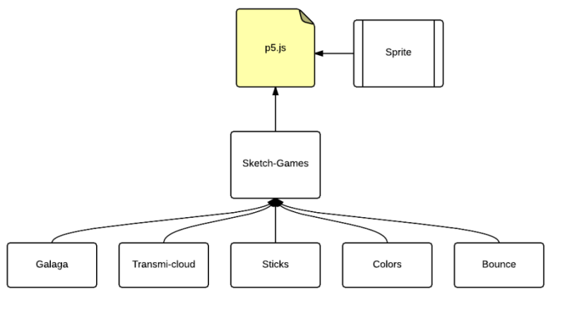

<section id="themes">
	<h2>Themes</h2>
		<p>
			Set your presentation theme: <br>
			<!-- Hacks to swap themes after the page has loaded. Not flexible and only intended for the reveal.js demo deck. -->
			<a href="#" onclick="document.getElementById('theme').setAttribute('href','css/theme/black.css'); return false;">Black (default)</a> -
			<a href="#" onclick="document.getElementById('theme').setAttribute('href','css/theme/white.css'); return false;">White</a> -
			<a href="#" onclick="document.getElementById('theme').setAttribute('href','css/theme/league.css'); return false;">League</a> -
			<a href="#" onclick="document.getElementById('theme').setAttribute('href','css/theme/sky.css'); return false;">Sky</a> -
			<a href="#" onclick="document.getElementById('theme').setAttribute('href','css/theme/beige.css'); return false;">Beige</a> -
			<a href="#" onclick="document.getElementById('theme').setAttribute('href','css/theme/simple.css'); return false;">Simple</a> <br>
			<a href="#" onclick="document.getElementById('theme').setAttribute('href','css/theme/serif.css'); return false;">Serif</a> -
			<a href="#" onclick="document.getElementById('theme').setAttribute('href','css/theme/night.css'); return false;">Night</a> -
			<a href="#" onclick="document.getElementById('theme').setAttribute('href','css/theme/moon.css'); return false;">Moon</a> -
			<a href="#" onclick="document.getElementById('theme').setAttribute('href','css/theme/solarized.css'); return false;">Solarized</a>
		</p>
</section>

H:

# ** Lenguaje Rust ** 

by  [Sebastian Chaves](https://github.com/adamantwharf) - [Laura Santos](https://github.com/lsfinite) - [Jimmy Pulido](https://github.com/jiapulidoar)
I
H:

# Index

<!-- .slide: data-background="#7E2121" --> 
 1. The main idea  <!-- .element: class="fragment" data-fragment-index="1"-->
 1. The way we did it <!-- .element: class="fragment" data-fragment-index="2"-->
 1. The Games <!-- .element: class="fragment" data-fragment-index="3"-->
 1. References <!-- .element: class="fragment" data-fragment-index="4"-->
H:

## Acerca de Rust 
  
**Rust** es un lenguaje de programación de sistemas que corre increíblemente rápido, previene fallos de segmentación y garantiza seguridad en la concurrencia.

V:
## Variables y mutabilidad

Variables y mutabilidad
Por defecto las variables en Rust son **inmutables.** Este es uno de los muchos codazos que brinda Rust para escribir código en una manera que aproveche la seguridad y facilidad de hacer concurrencia que ofrece Rust.


V:

Cuando una variable es inmutable, una vez que un valor está vinculado a un nombre, no puede cambiar ese valor. Para ilustrar esto, veremos un ejemplo:

```

fn main() {
    let x = 5;
    format!("The value of x is: {}", x);
    x = 6;
    eprintln!("The value of x is: {}", x);
}
main()

```

> let x = 5;
        ^ first assignment to `x`
    x = 6;
    ^^^^^ cannot assign twice to immutable variable
cannot assign twice to immutable variable `x`

El mensaje de error indica que la causa del error es que no puede asignar dos veces a la variable inmutable x, porque trató de asignar un segundo valor a la variable inmutable x.

H:
# *The way we did it *:
Each one of the games is a class, and Games, is the super class.  
 </img>


H:
# *The Games*

* Galaga

* Clouds

* Sticks

* Colors

* Bounce

V:
### Galaga 
<!-- .slide: data-background="#7E2121"  -->
  >A version of the clasic game. Is an arcade video game developed by Tomohiro Nishikado and released in 1978 <!-- .element: class="fragment" data-fragment-index="1"-->
  
More information on [Wikipedia](https://en.wikipedia.org/wiki/Space_Invaders) <!-- .element: class="fragment" data-fragment-index="1"-->

V:
#### <font color="red">Galaga Running! </font>
<!-- .slide: data-background="#000000"  -->
<iframe src="sketches/Galaga.html" width="700" height="700" align="center"> 


V: 
### Clouds
  > How far can you go?? The sky is the limit. With this game you will jump the higher you can. Just move te bus with the mouse to go up.

The inspiration for this game was the experience as a gamer. <!-- .element: class="fragment" data-fragment-index="1"-->

V:
#### Transmi-Cloud Running... 
<iframe src="sketches/Clouds.html" width="700" height="700" align="center"> 

V:
## Sticks 
> This game was based on the Towers of Hanoi. This Puzzle is a mathematical game invented in 1883 by the French mathematician Edouard Lucas.


The more you play, the more difficult it will become. 

For more information, on [Wikipedia]( https://es.wikipedia.org/wiki/Torres_de_Hanói)

V:
#### Sticks Running... 
<iframe src="sketches/Stick.html" width="700" height="700" align="center"> 

V:
## Colors
<!-- .slide: data-background="#7E2121"  -->
> This game consist of let the drop fall in the correct color cube. The drop will follow the mouse position.If you lose, just ckick any part of the canvas, a the game will start again.  
V:
#### Colors Running... 
<iframe src="sketches/Colors.html" width="700" height="700" align="center"> 

V:

## Bounce
 >Version of the classic game of the red ball that have to pass thought different mazes to achive their goal. The ball obeys the up/down, right/left arrows of the keyboard. 

V:
#### Bounce Running... 
<iframe src="sketches/Bounce.html" width="700" height="700" align="center"> 

V:
## Resume 
| The games   | How to play them                 |
| ------------|:--------------------------------:|
| Galaga      | Up/down arrows and mouse press   |
| Clouds      | With the position of the mouse   |  
| Sticks      | Ckick the towers with the mouse  | 
| Colors      | Follow the mouse position        |
|Bounce       | Use your keyboard arrows to play |

H:

## Now Available for web:  

<font color="black"> http:// futureun.github.io/FutureGame </font>
<!-- .slide: data-background="#2E9AFE"  -->


V:
## References

* [P5*JS](http://p5js.org/)
* [P5.PLay](http://p5play.molleindustria.org/)
* [Sounds Resources](http://www.sounds-resource.com/)
